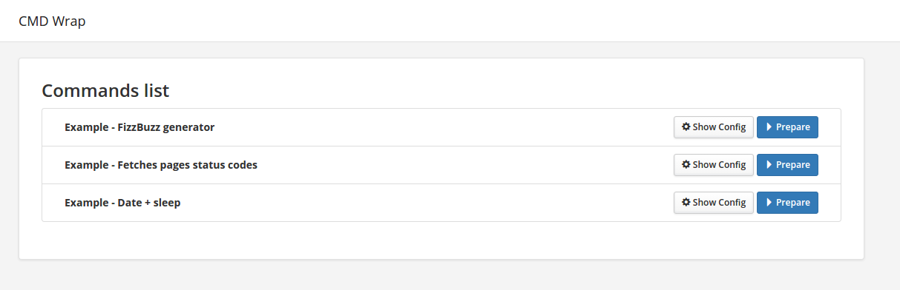

# CMD Wrap

CMD Wrap makes easy to expose command line scripts or other executables to the web interface.

## Case

When you have command line based script that needs to be executed by a non-technical person you can use this web interface accessible via browser to make things easier for him.
Fully compatible to anything you can execute, runs under the same user as web-server.

* Binary files
* Scripts (nodejs / python / ruby / php)
* Bash commands

## Installation

1. `git clone https://github.com/ziogas/cmdwrap.git`
1. Create all your needed commands in bin/ folder
1. Install npm dependencies with `npm install`
1. Copy `.env.sample` file to `.env` and modify according to your needs
1. Run `npm start`
1. On production you might want to run it on process manager like pm2 `pm2 start server.js --name "cmdwrap"`

## Usage

After starting the server go to HOSTNAME:8080 and you should see the list. Click "Prepare" and you will see all your options.
Nodejs will spawn your process and save its pid to ".lock" file.
All the output will be saved into stdout.log and stderr.log files.

## Configuration

>For more examples please explore `bin/` folder.

Every command should have its folder in "bin/" and in that folder "config.json" file.
Example config.json:

    {
      "name": "Example - Fetches pages status codes",
      "description": "Loads web pages from uploaded text file containing urls and outputs csv with status codes",
      "cwd": "./code/",
      "command": "phantomjs",
      "args": ["check-statuscodes.js"],
      "inputs": [
        {
          "type": "file",
          "name": "Urls file",
          "filename": "code/urls.txt"
        }
      ],
      "public": [
        "code/results.csv"
      ]
    }

Possible config options:

* `name` The name displayed on the interface
* `description` The description displayed on the interface
* `cwd` The directory where command is executed, relative to the main command directory
* `command` Actual command to execute
* `args` Array of command arguments, can contain placeholders like `%argument%` which are filled from inputs
* `inputs` Command inputs array displayed in the interface
* `public` Public files list which can be opened via interface. Usually it is result files

Possible input configuration:

* `type` Input type, can be "file", "text", "select"
* `name` Name displayed on the interface
* `default` Default value, not used in the "file" type
* `options` Array of input options. Used only in "select" type, format is { "text": "Interface text", "value": "actual value" }
* `argname` This will be used as a placeholder value in `args`

## Authentication

If you would like to protect the interface then modify `HTTP_AUTH_USERNAME` with `HTTP_AUTH_PASSWORD` in `.env` file.

## Caveats

Running command line scripts like this is not an optimal way so there might be some caveats:

* If you'll restart web server while command is executing you can terminate it. This means you can't run webserver on --watch mode
* You can launch only 1 instance of command at the same time
* Complicated/long processing commands might fail without clear reason

## More screenshots from example commands

## Contributing

1. Fork it!
2. Create your feature branch: `git checkout -b my-new-feature`
3. Commit your changes: `git commit -am 'Add some feature'`
4. Push to the branch: `git push origin my-new-feature`
5. Submit a pull request

## License

[MIT] Do whatever you want, attribution is nice but not required

*Initial bootstrap done by [megaboilerplate]*

[docker-compose]: https://docs.docker.com/compose/
[mit]: https://tldrlegal.com/license/mit-license
[megaboilerplate]: http://megaboilerplate.com
